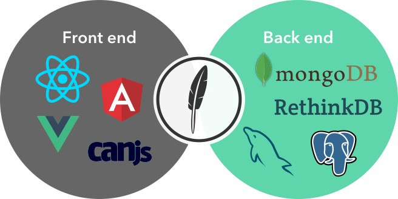
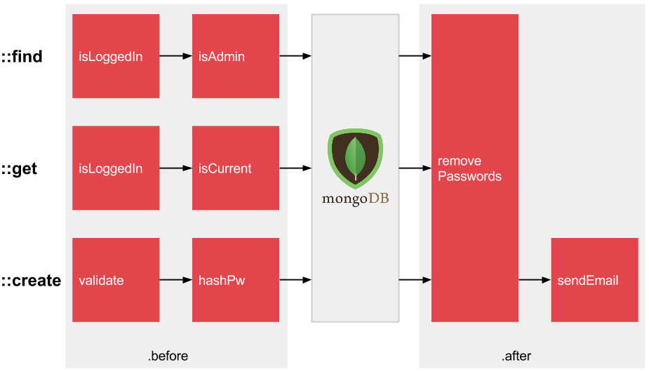

title: Feathers + React
output: index.html
theme: theme
controls: false
logo: theme/logo.png

-- centered


<h2>+</h2>


--

## So what is it?

> A batteries-included, modular JavaScript library for creating real-time applications.

- Out-of-the-box service-oriented REST and real-time APIs
- Universally usable in NodeJS, React Native and the browser
- Supports 15+ databases, 3+ ORMs
- Works with any client side stack
- Drop-in replacement for Express 4
- JWT authentication

-- centered

## Where it fits in



--

## Services

> CRUD resources that can be used like an Express middleware:

```javascript
const feathers = require('feathers');
const app = feathers();

const myService = {
  find(params) {},
  get(id, params) {},
  create(data, params) {},
  update(id, data, params) {},
  patch(id, data, params) {},
  remove(id, params) {},
  setup(app, path) {}
}

// Use it in your application at the `/todos` endpoint
app.use('/todos', myService);
```

-- centered

## Hooks

> Pluggable middleware that runs before and after a service method:




--

## Implementing Hooks

```javascript
const hooks = require('feathers-hooks');

app.configure(hooks());
app.service('todos').before({
  create(hook) {
    hook.data.createdAt = new Date();
  }
}).after({
  create(hook) {
    return sendEmail(hook.data)
      .then(() => hook);
  }
});
```

-- presenter


## David Luecke

* [<i class="fa fa-github"></i> daffl](https://github.com/daffl)
* [<i class="fa fa-twitter"></i> @daffl](http://twitter.com/daffl)


[yycjs.com/feathers-react](http://yycjs.com/feathers-react)
